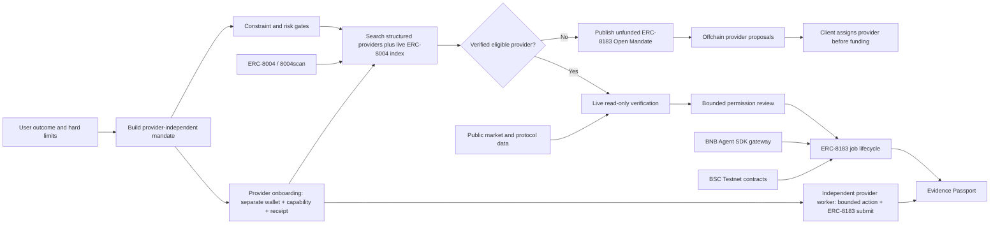

# MANDATE architecture

## Outcome-to-proof flow



## Trust boundaries

| Boundary | Enforcement |
|---|---|
| Natural language to permissions | Parsed capital, risk, leverage, action and protocol limits remain visible and individually editable; LP/Grid percentage caps are carried into the live gateway and echoed in its evidence. |
| Mandate build to provider search | Building stores the requirement independently. Search is a separate user action and cannot mutate hard limits. |
| Recommendation to activation | Candidates that exceed a hard limit are marked ineligible with explicit reasons. |
| Registry discovery to recommendation | Live ERC-8004 semantic hits remain discovery-only unless their metadata contains enough structured, verifiable limits for the mandate gate. Registry identity or textual similarity alone never becomes execution approval. |
| External identity to invitation | The detail flow records the candidate's BNB Chain ERC-8004 identity in an unfunded Open Mandate. It does not assign the provider or move funds before explicit acceptance. |
| No match to open demand | No candidate is invented and no hard limit is relaxed. The client may create an unfunded ERC-8183 job with the zero address provider, then explicitly assign a provider before funding. |
| Analysis to transaction | Live YieldRoute and Venus runs are read-only; they cannot request token approval or move funds. |
| External assignment | A2A/MCP providers with a public HTTPS endpoint can return a signed acceptance for the exact mandate digest; 8004scan domain verification is shown as a signal, but the EIP-191 receipt is the hard gate. Without that receipt, the client can only publish an unfunded Open Mandate. |
| Provider diversity | The hireable inventory is counted by distinct provider wallet and ERC-8004 receipt. Local onboarding records never promote a fixture without a confirmed receipt. A second wallet is required; four names controlled by one wallet do not count as four providers. |
| Provider capability | `/provider-onboarding` probes a provider-controlled HTTPS `mandate.provider-service.v1` document. Identity registration may happen before the first execution, but that record remains non-hireable. Promotion requires matching wallet, BSC Testnet, category, A2A/MCP protocol, bounded execution flags and at least one independently verified provider-signed transaction. |
| Read-only to asset execution | `GET /agents/execution-status` exposes the per-category prerequisites. Until a provider-owned session, allowlist and transaction receipt exist, the UI labels the service read-only and does not imply trading authority. Once assigned and funded, an external provider may receive `mandate.provider-execution-request.v1`; its signed receipt is verified against BSC Testnet before the result can be submitted as evidence. |
| Wallet to ERC-8183 | Every state-changing step is simulated first and requires a separate wallet confirmation. |
| ERC-8183 roles | The evaluator wallet is the client; only the registered provider wallet can submit. The shareable job URL carries the job ID across that handoff. |
| Token approval | Exactly 0.1 test U, never unlimited; Job #506 finished with zero residual allowance. |
| Result to evidence | The submitted deliverable hash binds a public manifest and a SHA-256-verified evidence snapshot. |

## Data provenance

- ERC-8004 registry context: live public 8004scan API on BNB Chain.
- Agent identities: BSC Testnet ERC-8004 Agents #1804-#1807.
- YieldRoute: current public BSC stablecoin pool and protocol TVL data from DefiLlama.
- Venus risk capability: official Venus Core Pool state at a pinned BSC block.

### External provider acceptance

The registry profile first sends `mandate.provider-acceptance-request.v1` to a callable public HTTPS provider endpoint. If the provider omits CORS headers, the same request may pass through the SSRF-guarded same-origin proxy. The request includes the BSC Testnet chain ID, ERC-8004 token ID, provider wallet, immutable mandate text and a keccak256 mandate digest. A provider may return that small schema, or the official BNBAgent A2A JSON-RPC `message/send` negotiation envelope. Compact acceptance receipts must include a future `expires_at_utc`; this prevents a signed quote from being replayed indefinitely. For A2A, MANDATE resolves `/.well-known/agent-card.json`, follows the card's advertised `negotiate` or `negotiate-erc8183-job` skill, verifies the request hash, provider wallet, signed negotiation hash, chain, Commerce contract, payment token, expiry and fixed 0.1 U ceiling, then anchors the same quote fields in the ERC-8183 job description. HTTP success, registry score or a declared endpoint is never treated as acceptance; a malformed or offline provider falls back to an unfunded Open Mandate.

### Provider capability document

An independent provider must expose JSON at the registered HTTPS endpoint before signing an identity. The minimum shape is below. The addresses and record values in this snippet are illustrative schema examples only; they are not MANDATE evidence and must never be copied into a submission as if they were real receipts:

```json
{
  "schema": "mandate.provider-service.v1",
  "version": 1,
  "chain_id": 97,
  "provider_address": "0x…",
  "service_protocol": "A2A",
  "categories": ["grid"],
  "acceptance_endpoint": "https://provider.example/mandate/accept",
  "execution_endpoint": "https://provider.example/mandate/execute",
  "capabilities": {"bounded_service_escrow": true, "bounded_testnet_execution": true, "asset_transactions": true},
  "execution_scope": {
    "category": "grid",
    "chain_id": 97,
    "allowed_actions": ["swap_bnb_usdt", "cancel", "pause"],
    "contract_allowlist": ["0x…"],
    "max_value_wei": "100000000000000000"
  },
  "execution_receipts": ["0x…64-byte-successful-provider-tx…"],
  "track_record": {
    "schema": "mandate.agent-track-record.v1",
    "mode": "realized-onchain",
    "window": {"start_utc": "2026-08-01T00:00:00Z", "end_utc": "2026-08-28T00:00:00Z"},
    "summary": {"executed_trades": 2, "winning_trades": 1, "losing_trades": 1, "win_rate_pct": 50, "max_drawdown_pct": 2.4},
    "risk_exposure": {"position_side": "long/flat", "leverage": 0, "max_loss_pct": 5, "notes": "Provider-owned wallet; no borrowed funds."},
    "onchain_evidence": {"chain_id": 97, "transactions": [{"hash": "0x…", "executed_at_utc": "2026-08-20T00:00:00Z"}]}
  }
}
```

The browser independently reads every listed transaction and requires a successful BSC Testnet contract call whose `from` address equals the connected provider wallet, whose `to` is in the declared contract allowlist, and whose calldata is non-empty. A provider that does not expose CORS may use the dedicated GET-only card/capability proxy; neither proxy accepts arbitrary URLs or signs for a provider. The document is a capability claim, not a replacement for signed ERC-8183 client/provider actions. The repository's separate `backend/provider_service` reference worker fails closed without a signer and explicit allowlisted calldata, locks execution per job, runs the bounded provider action, submits the hash-bound deliverable and publishes both receipts. Run exactly one worker process per wallet/category unless an external distributed lock is added.

### External execution receipt

After the client assigns and funds an external provider, the Commerce page first honors the official BNBAgent `notify_funded` skill when the Agent Card advertises it; the acknowledgement is only a delivery-start notice, and the chain is polled for the provider's own ERC-8183 submission. Providers without that seller flow can receive one bounded action request and return `mandate.provider-execution-receipt.v1` (or an A2A `message/send` data part) containing the exact mandate digest and one-time request nonce, a category-matched action, provider-signed canonical receipt, execution scope, successful transaction hash/target and optional provider-signed `AgenticCommerce.submit` receipt. The detached `receipt_digest` is `keccak256` of the recursive-key-sorted compact JSON payload with both `signature` and `receipt_digest` omitted; this avoids a circular hash. MANDATE checks the signature, chain 97, job/category/action, digest/nonce, `from`, `to`, non-empty calldata, value ceiling and allowlist with the public client. A provider that only returns a registry card, HTTP 200 or a paper result is not treated as executable.
- TermiX benchmarks: three frozen, same-input A/B fixtures with raw JSON outputs and locked rubrics.
- Candidate historical cards: unverified fixture rows are withheld from the hireable inventory; only live runs and linked benchmark/onchain receipts are shown as evidence.

## Contracts used by Job #506

| Component | Address |
|---|---|
| AgenticCommerce | `0xa206c0517B6371C6638CD9e4a42Cc9f02A33B0DE` |
| Router | `0xD7d36D66d2F1B608A0F943f722D27e3744f66F25` |
| Optimistic policy | `0xd6a4217588f6b1f5657a92a3e94e6422ad771cea` |
| Test U | `0xc70B8741B8B07A6d61E54fd4B20f22Fa648E5565` |
