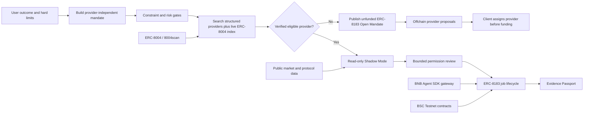

# MANDATE architecture

## Outcome-to-proof flow

## Trust boundaries

| Boundary | Enforcement |
|---|---|
| Natural language to permissions | Parsed capital, risk, leverage, action and protocol limits remain visible and individually editable. |
| Mandate build to provider search | Building stores the requirement independently. Search is a separate user action and cannot mutate hard limits. |
| Recommendation to activation | Candidates that exceed a hard limit are marked ineligible with explicit reasons. |
| Registry discovery to recommendation | Live ERC-8004 semantic hits remain discovery-only unless their metadata contains enough structured, verifiable limits for the mandate gate. Registry identity or textual similarity alone never becomes execution approval. |
| External identity to invitation | The detail flow records the candidate's BNB Chain ERC-8004 identity in an unfunded Open Mandate. It does not assign the provider or move funds before explicit acceptance. |
| No match to open demand | No candidate is invented and no hard limit is relaxed. The client may create an unfunded ERC-8183 job with the zero address provider, then explicitly assign a provider before funding. |
| Analysis to transaction | Live YieldRoute and Venus runs are read-only; they cannot request token approval or move funds. |
| Wallet to ERC-8183 | Every state-changing step is simulated first and requires a separate wallet confirmation. |
| ERC-8183 roles | The evaluator wallet is the client; only the registered provider wallet can submit. The shareable job URL carries the job ID across that handoff. |
| Token approval | Exactly 0.1 test U, never unlimited; Job #506 finished with zero residual allowance. |
| Result to evidence | The submitted deliverable hash binds a public manifest and a SHA-256-verified evidence snapshot. |

## Data provenance

- ERC-8004 registry context: live public 8004scan API on BNB Chain.
- Agent identities: BSC Testnet ERC-8004 Agents #1804-#1807.
- YieldRoute: current public BSC stablecoin pool and protocol TVL data from DefiLlama.
- Venus risk capability: official Venus Core Pool state at a pinned BSC block.
- TermiX benchmarks: three frozen, same-input A/B fixtures with raw JSON outputs and locked rubrics.
- Candidate historical cards: labelled demo/sample unless backed by the benchmark or Job #506 evidence.

## Contracts used by Job #506

| Component | Address |
|---|---|
| AgenticCommerce | `0xa206c0517B6371C6638CD9e4a42Cc9f02A33B0DE` |
| Router | `0xD7d36D66d2F1B608A0F943f722D27e3744f66F25` |
| Optimistic policy | `0xd6a4217588f6b1f5657a92a3e94e6422ad771cea` |
| Test U | `0xc70B8741B8B07A6d61E54fd4B20f22Fa648E5565` |
